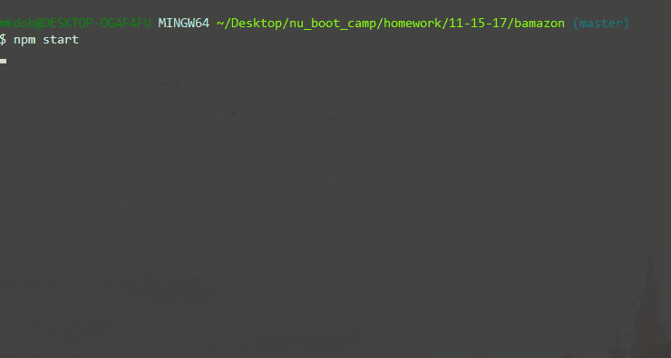

# Bamazon!

Bamazon is like amazon, but with more B! ...The 'B' is for better. Better how?? Well, Amazon doesn't allow you to have command line fun while you shop, do they?? Experience the wonders of node.js while you browse our many great products. You'll feel like you're in the Matrix and you'll save a boat load of ca$h!  

## How It Works
Following the [Twelve-Factor App methodology](https://12factor.net/config), configuration files and mySQL database credentials are kept in seperate files and stored as enviromental variables where needed. Upon start, users are greeted with a display of available items and a prompt for an item id they would like to add to their cart. All item information is pulled from the a SQL database. After a valid id is entered, the user is then prompted for a quantity input. Quantity is checked against the database for availability. If valid, the user to prompted to confirm 'Add to Cart' or Cancel. All menus work similarly. Users are free to visit their cart, shop more, or checkout as they wish. Checkout updates the SQL database, thanks the user, and then exits the program automatically. 

## Installation

If you want to clone, you'll have to npm install to grab all of the necessary packages and then setup and connect your own mySQL database.   

## Technologies

| Built With   
| ------------- 
| [Node.js] - Server-side JavaScript Magic 
| [mySQL] -  Relational Database/ Inventory Tracker
| [DOTENV] - Node Package for storing and serving enviromental variables and configuration files
| [Inquirer] - Node Package for CLI inputs
| [Columnify] - Node Package for beautifying data displays
| [Text-Animation] - Node Package.. it animations text!

## Built by: **Michael Doherty** - [mkdoh3](https://github.com/mkdoh3)

